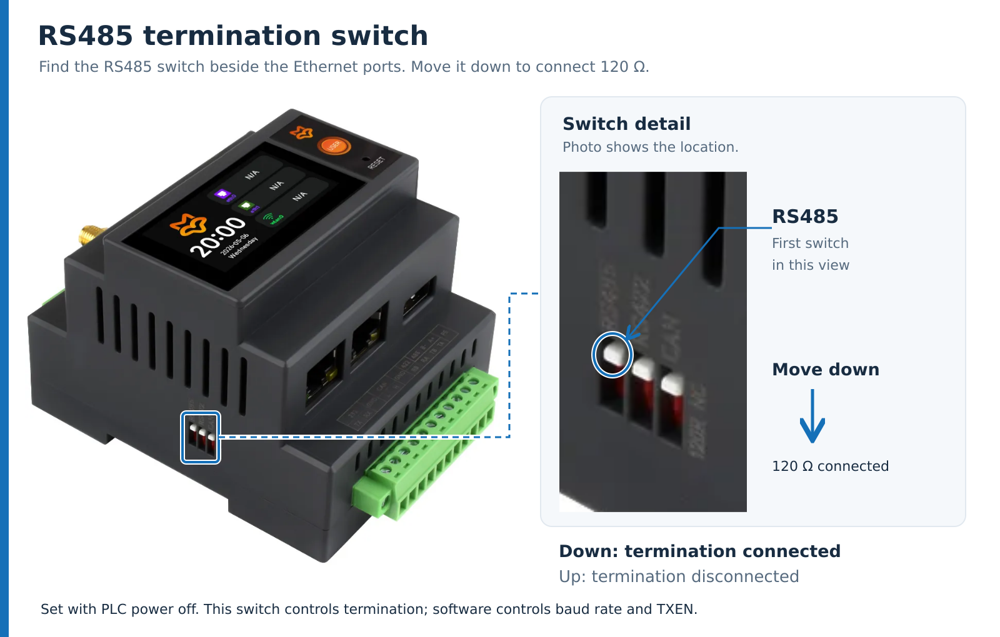

# Luckfox Lyra PLC RS485 Test

[简体中文](README.md) | **English**

Build the same [rs485_test.c](rs485_test.c) on an Ubuntu computer and a Luckfox Lyra PLC to test communication in both directions through a USB to RS485 adapter. The program generates test data, sends replies, and checks the results. No manual data entry or Python is required.

This example uses a private test frame with a sequence number, test data, and CRC16. **It is not a Modbus RTU program.** The serial format is fixed at **8 data bits, no parity, 1 stop bit (8N1), with no flow control**.

## 1. Hardware and Wiring

Prepare an Ubuntu computer, a separately powered Luckfox Lyra PLC, a USB to RS485 adapter with automatic direction control, and wires for A/B and signal ground. The computer also needs a network connection to the PLC for SSH.


[Open the scalable SVG wiring diagram](images/rs485-wiring.svg). The connection map groups terminals by signal; use the manufacturer pinout below to locate the physical PLC terminals.

1. With power disconnected, connect the adapter's USB plug to the computer, using a USB extension cable if needed.
2. Connect the adapter to the PLC as shown below. Use a twisted pair for A/B where possible.
3. Check the wiring and set the RS485 termination switch as described below, then power the PLC separately. The computer's USB port powers the adapter, not the PLC.

| USB to RS485 terminal | PLC terminal | PLC pin number |
| --- | --- | ---: |
| `A+` / `A` | `TA / A+` (RS485_A) | 10 |
| `B-` / `B` | `TB / B-` (RS485_B) | 9 |
| `GND` (signal ground) | `SGND` | 6 |

**Connect A to A and B to B.** On the illustrated adapter, `USB TO RS485 (B)` is a model label. Use the `GND`, `A+`, and `B-` markings on the green terminal block for wiring.

Connect signal ground to PLC pin 6, `SGND`, to provide a common reference. For an isolated adapter, use its RS485 bus-side signal ground. `PE` is protective earth and is not the `SGND` connection shown here. Pins 7 and 8 are RS422 `RB` and `RA`; leave them unconnected in this example. Do not bridge them to `TB` or `TA`.


### RS485 Termination Switch

The switches are on the **side of the PLC, beside the Ethernet ports**, as shown below. From left to right in this view, they are marked `RS485`, `RS422`, and `CAN`. Use the **first switch on the left, marked RS485**, and check the label on the enclosure before moving it.



[Open the enlarged switch diagram (SVG)](images/plc-rs485-switch.svg). The photo identifies the switch; do not copy its photographed position as the test setting.

> **Note: RS485 and RS422 share serial resources.** This board has one RS422/RS485 serial port (UART2, `/dev/ttyS2`). Pins 9 and 10 serve as both RS485 `B/A` and RS422 `TB/TA`. Do not treat them as two independent serial ports or connect two separate devices for independent communication at the same time.
>
> This example uses two-wire RS485. Connect only pins 6, 9, and 10. Leave pins 7 and 8 (`RB/RA`) unconnected and do not bridge them to `TB/TA`. For a defined termination setup, **set the RS485 switch down to connect 120 Ω, and set the unused RS422 switch up to disconnect its termination resistor**. Set the CAN switch according to the actual CAN bus requirements.
>
> The switches control termination only; they do not select RS485 or RS422 mode. Enabling both switches does not provide another serial port. Before changing to RS422, power off and configure the wiring and termination for the RS422 connection.

| RS485 switch position | Function | Setting for this example |
| --- | --- | --- |
| Down | Connect the onboard **120 Ω termination resistor** across RS485 A/B | Use this position: the USB adapter and PLC are the two endpoints |
| Up | Disconnect the onboard termination resistor | Use when the PLC is an intermediate node on a multi-node bus |

Set the switch with PLC power off, then power up for the test. Configure 120 Ω termination at the adapter end according to its manual. If termination is already built in or enabled, do not add another resistor in parallel. On a multi-node bus, enable termination only at its two physical ends.

The program's `-b` option sets the baud rate, and the program controls GPIO15 TXEN for transmit/receive direction. The termination switches control neither setting.

The down position is documented under the interface description on the [manufacturer product page](https://www.luckfox.cn/Luckfox-Lyra-PLC).

### PLC Serial Port and Direction Control

| Item | Example configuration |
| --- | --- |
| RS485 serial port | `/dev/ttyS2` (UART2) |
| TXEN pin | `GPIO0_B7` |
| GPIO controller | `/dev/gpiochip0` |
| Line offset within the controller | `15` |
| TXEN level | High to transmit, low to receive |

The PLC requires software control of TXEN. The C program performs the complete sequence on the PLC: raise TXEN, send, wait for the UART to empty, lower TXEN immediately, and receive. No manual GPIO operation is needed. **Keep the GPIO options on the PLC in both `ping` and `reply` modes.** The USB adapter controls its own direction; do not add GPIO options on the computer.

Before testing, close any serial terminal or other application using the port. If UART2 is open in the PLC web interface, close it there to release the serial port and TXEN GPIO.

## 2. Computer: Find the Serial Port and Grant Access

Run computer commands in **terminal A** on Ubuntu. Start in the repository root, then enter the example directory:

```bash
cd hardware/rs485
```

After connecting the USB adapter, list the devices:

```bash
lsusb
ls -l /dev/serial/by-id/
ls -l /dev/ttyUSB* /dev/ttyACM* 2>/dev/null
```

The adapter may appear as `/dev/ttyUSB0` or `/dev/ttyACM0`. It is normal for one of these device types to be absent. Compare the device list before and after connecting the adapter to identify the correct port.

Prefer the stable path under `/dev/serial/by-id/`. The following is the path of the tested adapter; replace it with your device name. If no `by-id` path is available, use the actual device node, for example `RS485_PORT=/dev/ttyACM0`:

```bash
RS485_PORT=/dev/serial/by-id/usb-1a86_USB_Single_Serial_5658002104-if00
readlink -f "$RS485_PORT"
```

Install the compiler and ACL tools, then grant the current user read/write access to this serial port:

```bash
sudo apt update
sudo apt install -y build-essential acl
sudo setfacl -m "u:$(id -un):rw" "$RS485_PORT"
getfacl -p "$RS485_PORT"
```

The ACL output should show `rw-` access for your user. Repeat `setfacl` after unplugging and reconnecting the adapter. `RS485_PORT` is local to the current terminal; set it again when opening a new terminal.

For persistent group access, you can instead run `sudo usermod -aG dialout "$(id -un)"`, then fully log out and log back in. This applies to Ubuntu systems where the device node belongs to the `dialout` group.

## 3. Computer: Build the Program

In terminal A, from `hardware/rs485`, run:

```bash
mkdir -p build
gcc -std=c11 -O2 -Wall -Wextra -Wpedantic -Werror \
  rs485_test.c -o build/rs485_test
./build/rs485_test --help
```

The computer executable is `build/rs485_test`. The program uses Linux system interfaces and libc; no additional serial library is required.

## 4. PLC: Copy the Source and Build

In **terminal A (Ubuntu)**, set the PLC login address. `10.10.20.101` is an example; replace it with the current PLC IP and adjust the username if needed:

```bash
PLC_HOST=lyra@10.10.20.101
ssh "$PLC_HOST" 'mkdir -p ~/rs485-example'
scp rs485_test.c "$PLC_HOST":rs485-example/
```

Enter the PLC login password when prompted. These commands copy the source into the PLC user's `~/rs485-example/` directory, rather than copying the computer executable.

Open **terminal B** and log in to the PLC:

```bash
ssh lyra@10.10.20.101
```

After login, run the following commands **on the PLC**:

```bash
cd ~/rs485-example
gcc --version
ls -l /dev/ttyS2 /dev/gpiochip0
```

If GCC is missing, install it using the board image's package manager. On images that support APT, run:

```bash
sudo apt update
sudo apt install -y build-essential
```

Build the same source on the PLC:

```bash
mkdir -p build
gcc -std=c11 -O2 -Wall -Wextra -Wpedantic -Werror \
  rs485_test.c -o build/rs485_test
./build/rs485_test --help
sudo -v
```

Both executables are named `build/rs485_test`, but they are on different machines. A typical Ubuntu computer uses x86_64, while the PLC uses ARM. **Build on each machine; the executables are not interchangeable.** Run the PLC program with `sudo` to access the serial port and GPIO.

## 5. Run: Computer Sends, PLC Replies

Keep both terminals open: terminal A runs the Ubuntu program, and terminal B runs the PLC program over SSH. **Start `reply` first, wait for `READY`, then start `ping`.**

This test uses **115200 baud, 100 round trips, and 256 bytes of test data per frame**.

### 5.1 Start the Responder in Terminal B (PLC)

```bash
cd ~/rs485-example
sudo ./build/rs485_test \
  -d /dev/ttyS2 -m reply \
  -b 115200 -n 100 -t 60000 -g 5 \
  --rs485 off --gpiochip /dev/gpiochip0 --txen-line 15
```

After `TXEN ... active_high=1 idle=0` and `READY ... mode=reply` appear, switch to terminal A. `-t 60000` allows up to 60 seconds to wait for a request, giving you time to switch terminals. It does not delay each reply by 60 seconds. Restart the responder if it exits after a timeout.

`--rs485 off` disables kernel RTS direction control during the test so the program can use the PLC's separate TXEN GPIO. The program restores previous serial settings during normal cleanup.

### 5.2 Start the Initiator in Terminal A (Ubuntu)

Remain in `hardware/rs485`, with `RS485_PORT` already set:

```bash
./build/rs485_test \
  -d "$RS485_PORT" -m ping \
  -b 115200 -n 100 -l 256 -t 3000 -g 5
```

The computer sends a request, waits for the PLC reply, and checks the sequence number, content, and CRC. Both terminals should finish with `SUMMARY ... result=PASS`.

### 5.3 Check the Results

Immediately after the program exits, check its exit code in each terminal:

```bash
echo $?
```

The exit code should be `0`. Do not run another command before reading it: `$?` is the status of the most recent command.

| SUMMARY field | Expected in this test | Meaning |
| --- | --- | --- |
| `sent` | `100` | Frames sent by this endpoint |
| `valid` / `expected` | `100` / `100` | All expected frames were valid |
| `timeouts` / `mismatch` | Both `0` | No timeout or content mismatch |
| `crc_errors` / `discarded_bytes` | Both `0` | No CRC errors or discarded bytes |
| `unexpected` | `0` | No unexpected frames |
| `txen_cycles` | `100` on PLC, `0` on computer | GPIO direction control cycles |
| `result` | `PASS` | This endpoint passed |

Press `Ctrl+C` to stop early; the exit code is `130`. Normal cleanup releases the devices and sets TXEN low. Before starting another test, make sure both programs from the previous test have exited.

## 6. Reverse Test: PLC Sends, Computer Replies

After the first test finishes, swap the roles to check communication initiated by the PLC.

**Start the responder in terminal A (Ubuntu) first:**

```bash
./build/rs485_test \
  -d "$RS485_PORT" -m reply \
  -b 115200 -n 100 -t 60000 -g 5
```

**After READY appears, start the initiator in terminal B (PLC):**

```bash
sudo ./build/rs485_test \
  -d /dev/ttyS2 -m ping \
  -b 115200 -n 100 -l 256 -t 3000 -g 5 \
  --rs485 off --gpiochip /dev/gpiochip0 --txen-line 15
```

Check for `result=PASS` and exit code `0` on both endpoints. After sending the last frame, the USB responder waits briefly for transmission to finish. At low baud rates, it may take a few extra seconds to return to the shell.

## 7. Common Options

Run `./build/rs485_test --help` for the full option list.

| Option | Default | Description |
| --- | --- | --- |
| `-d, --device PATH` | Required | Serial device; use the detected USB port on the computer and `/dev/ttyS2` on the PLC |
| `-m, --mode ping\|reply` | Required | `ping` initiates requests; `reply` receives and answers them |
| `-b, --baud N` | `9600` | Baud rate; **must match on both endpoints** |
| `-n, --count N` | `100` | Frame count, 1–1000000; use the same value on both endpoints. `0` does not mean unlimited |
| `-l, --length N` | `256` | Test data length for `ping`, 1–4096 bytes; `reply` uses the received length |
| `-t, --timeout MS` | `3000` | Timeout for an individual send/receive wait, in ms, 100–600000; use 60000 for a manually started responder |
| `-g, --gap MS` | `5` | Delay between `ping` requests, or before sending a `reply`, 0–60000 ms |
| `-v, --verbose` | Off | Print every frame; useful for short diagnostic tests |
| `--gpiochip PATH` | `/dev/gpiochip0` | GPIO controller for PLC TXEN |
| `--txen-line N` | GPIO control disabled | Set to `15` on this PLC; this is a controller line offset, not a terminal pin number |
| `--txen-setup-us N` | `20` | Delay in microseconds after raising TXEN and before the first byte; normally keep the default |
| `-r, --rs485 MODE` | `keep` | Kernel RS485 mode: `keep` preserves it, `off` disables it, `high`/`low` use kernel RTS direction control. Keep the default on the computer; use `off` plus GPIO control on the PLC |

`--rs485 high/low` cannot replace `--txen-line 15` on this board and cannot be combined with manual GPIO TXEN control.

Exit codes: `0` passed; `1` validation failure or timeout; `2` argument, device setup, or I/O error; `130` interrupted.

## 8. Change the Baud Rate

**Change `-b` in both commands. No source edit or rebuild is needed.** For example, replace `-b 115200` with `-b 9600`. Stop the old test, then restart both programs with the same new baud rate, again starting `reply` before `ping`.

Example: **9600 baud, 6 round trips, 32 bytes of test data**.

**First, on the PLC:**

```bash
sudo ./build/rs485_test \
  -d /dev/ttyS2 -m reply \
  -b 9600 -n 6 -t 60000 \
  --rs485 off --gpiochip /dev/gpiochip0 --txen-line 15
```

**Then, on Ubuntu:**

```bash
./build/rs485_test \
  -d "$RS485_PORT" -m ping \
  -b 9600 -n 6 -l 32 -t 3000 -v
```

The source accepts `1200`, `2400`, `4800`, `9600`, `19200`, `38400`, `57600`, `115200`, `230400`, `460800`, and `921600`. The serial driver and adapter must also support the selected rate. Previous hardware tests covered common rates from 9600 through 115200; accepting a value in the source does not mean every rate has been verified.

Increase the initiator's `-t` for long frames at low baud rates. At 9600 baud with a 4096-byte payload, one round trip takes about 8.56 seconds on the wire alone. For example, use `-t 12000` instead of `3000`. This is a timeout configuration example; that combination was not covered by the previous hardware tests.

## 9. Troubleshooting

| Symptom | What to check |
| --- | --- |
| `Permission denied` | Reapply the serial ACL on the computer; use `sudo` on the PLC |
| Serial device not found | Check the USB connection and list `/dev/serial/by-id/` or the actual device nodes again |
| `Device or resource busy` / GPIO request fails | Close serial terminals, previous test processes, and applications using UART2 / GPIO15; close UART2 in the PLC web interface |
| `Manual GPIO TXEN requires kernel RS485 mode disabled` | Keep `--rs485 off` and both GPIO options in the PLC command |
| Timeout, CRC error, or mismatch | Check A/B/SGND wiring, termination switches, matching baud rates, responder-first startup, and that both endpoints run this example |
| `RS485_IOCTL unavailable` on USB | Some USB drivers lack kernel RS485 ioctls. Keep the default `keep` on the computer, let the adapter control direction, and check the final result |
| `Exec format error` | Wrong executable architecture; rebuild the source on the target machine |

A plain serial text terminal or Modbus slave cannot replace this example's `reply` program. Both endpoints must use the same test frame protocol.
