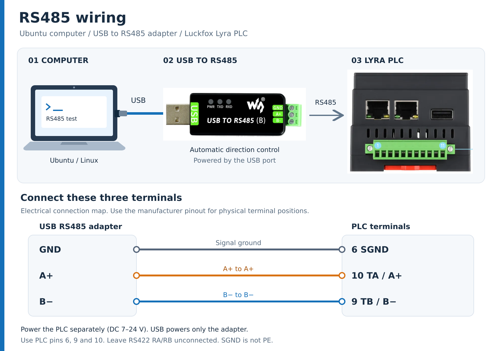
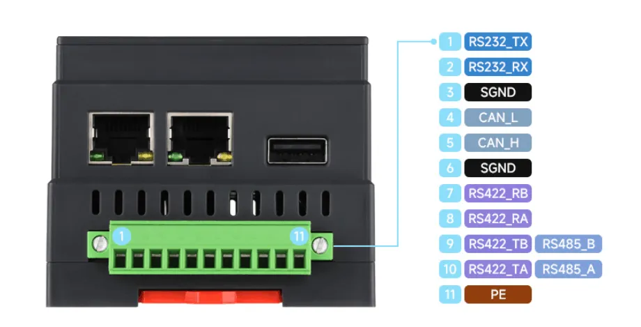

# Luckfox Lyra PLC RS485 Test

[简体中文](README.md) | **English**

Build the same [rs485_test.c](rs485_test.c) on an Ubuntu computer and a Luckfox Lyra PLC to test communication in both directions through a USB to RS485 adapter. The program generates test data, sends replies, and checks the results. No manual data entry or Python is required.

This example uses a private test frame with a sequence number, test data, and CRC16. **It is not a Modbus RTU program.** The serial format is fixed at **8 data bits, no parity, 1 stop bit (8N1), with no flow control**.

## 1. Hardware and Wiring

Prepare an Ubuntu computer, a separately powered Luckfox Lyra PLC, a USB to RS485 adapter with automatic direction control, and wires for A/B and signal ground. The computer also needs a network connection to the PLC for SSH.



[Open the scalable SVG wiring diagram](images/rs485-wiring.svg). The connection map groups terminals by signal; use the manufacturer pinout below to locate the physical PLC terminals.

1. With power disconnected, connect the adapter's USB plug to the computer, using a USB extension cable if needed.
2. Connect the adapter to the PLC as shown below. Use a twisted pair for A/B where possible.
3. Check the wiring, then power the PLC separately. The computer's USB port powers the adapter, not the PLC.

| USB to RS485 terminal | PLC terminal | PLC pin number |
| --- | --- | ---: |
| `A+` / `A` | `TA / A+` (RS485_A) | 10 |
| `B-` / `B` | `TB / B-` (RS485_B) | 9 |
| `GND` (signal ground) | `SGND` | 6 |

**Connect A to A and B to B.** On the illustrated adapter, `USB TO RS485 (B)` is a model label. Use the `GND`, `A+`, and `B-` markings on the green terminal block for wiring.

Connect signal ground to PLC pin 6, `SGND`, to provide a common reference. For an isolated adapter, use its RS485 bus-side signal ground. `PE` is protective earth and is not the `SGND` connection shown here. Pins 7 and 8 are RS422 `RB` and `RA`; leave them unconnected in this example. Do not bridge them to `TB` or `TA`.



> The switches control termination only; they do not select RS485 or RS422 mode. Enabling both switches does not provide another serial port. Before changing to RS422, power off and configure the wiring and termination for the RS422 connection.

### PLC Serial Port and Direction Control

| Item | Example configuration |
| --- | --- |
| RS485 serial port | `/dev/ttyS2` (UART2) |
| TXEN pin | `GPIO0_B7` |
| GPIO controller | `/dev/gpiochip0` |
| Line offset within the controller | `15` |
| TXEN level | High to transmit, low to receive |

The PLC requires software control of TXEN. The C program performs the complete sequence on the PLC: raise TXEN, send, wait for the UART to empty, lower TXEN immediately, and receive. No manual GPIO operation is needed. **Keep the GPIO options on the PLC in both `ping` and `reply` modes.** The USB adapter controls its own direction; do not add GPIO options on the computer.

Before testing, close any serial terminal or other application using the port. If UART2 is open in the PLC web interface, close it there to release the serial port and TXEN GPIO.

## 2. Computer: Find the Serial Port and Grant Access

Run computer commands in **terminal A** on Ubuntu. Start in the repository root, then enter the example directory:

```bash
cd hardware/rs485
```

Connect the USB adapter and list the detected serial ports:

```bash
ls -l /dev/ttyUSB* /dev/ttyACM* 2>/dev/null
```

**Use the port name detected on your computer.** The example below uses `/dev/ttyUSB0`; replace it with `/dev/ttyACM0` or another name if that is the port your computer detects.

```bash
RS485_PORT=/dev/ttyUSB0
```

Install the compiler and permission tools, then grant the current user read/write access to that port:

```bash
sudo apt update
sudo apt install -y build-essential acl
sudo setfacl -m "u:$(id -un):rw" "$RS485_PORT"
```

After reconnecting the USB adapter, check the port name and grant access again. Set `RS485_PORT` again when opening a new terminal.

## 3. Computer: Build the Program

In **terminal A**, from `hardware/rs485`, run:

```bash
gcc -std=c11 -O2 -Wall -Wextra rs485_test.c -o rs485_test_pc
```

This creates `rs485_test_pc` in the current directory. Run this executable on the Ubuntu computer.

## 4. PLC: Upload the Source and Build

**Step 1: Upload the source from terminal A (computer).** Replace `10.10.20.101` with your PLC's IP address and adjust the username if needed.

```bash
ssh lyra@10.10.20.101 'mkdir -p ~/rs485-example'
scp rs485_test.c lyra@10.10.20.101:rs485-example/
```

The first command creates a directory on the PLC; the second copies the source into it. Enter the PLC password when prompted.

**Step 2: Open terminal B and log in to the PLC.**

```bash
ssh lyra@10.10.20.101
```

**Step 3: After login, build the program on the PLC.**

```bash
cd ~/rs485-example
gcc -std=c11 -O2 -Wall -Wextra rs485_test.c -o rs485_test_plc
```

This creates `rs485_test_plc` in the PLC's `~/rs485-example` directory. Run it on the PLC. Build the same source on each machine; the executables are not interchangeable.

If you see `gcc: command not found`, run the following on a PLC image that supports APT, then repeat the build command:

```bash
sudo apt update
sudo apt install -y build-essential
```

## 5. Run: Computer Sends, PLC Replies

This test uses **115200 baud, 100 round trips, and 256 bytes per frame**.

**Step 1: Start the responder in terminal B (PLC).**

```bash
sudo ./rs485_test_plc -d /dev/ttyS2 -m reply -b 115200 -n 100 -t 60000 \
  --rs485 off --gpiochip /dev/gpiochip0 --txen-line 15
```

When `READY` appears, switch to terminal A. The responder waits up to 60 seconds for a request; restart it if it exits after a timeout. Keep the GPIO options in the PLC command so the program can switch between transmit and receive automatically.

**Step 2: Start the test in terminal A (computer).**

```bash
./rs485_test_pc -d "$RS485_PORT" -m ping -b 115200 -n 100
```

`RS485_PORT` is the actual serial port set in step 2. The program sends data and checks the PLC's replies automatically.

**Step 3: Check the result.** Both terminals should finish with `SUMMARY ... result=PASS`. Press `Ctrl+C` to stop early. Wait for both programs to exit before starting another test.

## 6. Optional Reverse Test: PLC Sends, Computer Replies

After the previous test finishes, you can swap the roles.

**First, start the responder in terminal A (computer):**

```bash
./rs485_test_pc -d "$RS485_PORT" -m reply -b 115200 -n 100 -t 60000
```

**When READY appears, start sending in terminal B (PLC):**

```bash
sudo ./rs485_test_plc -d /dev/ttyS2 -m ping -b 115200 -n 100 \
  --rs485 off --gpiochip /dev/gpiochip0 --txen-line 15
```

Both terminals should finish with `result=PASS`. At low baud rates, the computer responder may take a few extra seconds to exit after sending the last reply.

## 7. Common Options

Common options are listed below. Omitted options use their defaults. For the full option list, run `./rs485_test_pc --help` on the computer or `./rs485_test_plc --help` on the PLC.

| Option | Default | Description |
| --- | --- | --- |
| `-d, --device PATH` | Required | Serial device; use the detected USB port on the computer and `/dev/ttyS2` on the PLC |
| `-m, --mode ping\|reply` | Required | `ping` initiates requests; `reply` receives and answers them |
| `-b, --baud N` | `9600` | Baud rate; **must match on both endpoints** |
| `-n, --count N` | `100` | Frame count, 1–1000000; use the same value on both endpoints. `0` does not mean unlimited |
| `-l, --length N` | `256` | Test data length for `ping`, 1–4096 bytes; `reply` uses the received length |
| `-t, --timeout MS` | `3000` | Timeout for an individual send/receive wait, in ms, 100–600000; use 60000 for a manually started responder |
| `-g, --gap MS` | `5` | Delay between `ping` requests, or before sending a `reply`, 0–60000 ms |
| `-v, --verbose` | Off | Print every frame; useful for short diagnostic tests |
| `--gpiochip PATH` | `/dev/gpiochip0` | GPIO controller for PLC TXEN |
| `--txen-line N` | GPIO control disabled | Set to `15` on this PLC; this is a controller line offset, not a terminal pin number |
| `--txen-setup-us N` | `20` | Delay in microseconds after raising TXEN and before the first byte; normally keep the default |
| `-r, --rs485 MODE` | `keep` | Kernel RS485 mode: `keep` preserves it, `off` disables it, `high`/`low` use kernel RTS direction control. Keep the default on the computer; use `off` plus GPIO control on the PLC |

`--rs485 high/low` cannot replace `--txen-line 15` on this board and cannot be combined with manual GPIO TXEN control.

Exit codes: `0` passed; `1` validation failure or timeout; `2` argument, device setup, or I/O error; `130` interrupted.

## 8. Change the Baud Rate

**Change `-b` in both commands. No source edit or rebuild is needed.** For example, replace `-b 115200` with `-b 9600`. Stop the old test, then restart both programs with the same new baud rate, again starting `reply` before `ping`.

Example: **9600 baud, 6 round trips, 32 bytes of test data**.

**First, on the PLC:**

```bash
sudo ./rs485_test_plc \
  -d /dev/ttyS2 -m reply \
  -b 9600 -n 6 -t 60000 \
  --rs485 off --gpiochip /dev/gpiochip0 --txen-line 15
```

**Then, on Ubuntu:**

```bash
./rs485_test_pc \
  -d "$RS485_PORT" -m ping \
  -b 9600 -n 6 -l 32 -t 3000 -v
```

The source accepts `1200`, `2400`, `4800`, `9600`, `19200`, `38400`, `57600`, `115200`, `230400`, `460800`, and `921600`. The serial driver and adapter must also support the selected rate. Previous hardware tests covered common rates from 9600 through 115200; accepting a value in the source does not mean every rate has been verified.

Increase the initiator's `-t` for long frames at low baud rates. At 9600 baud with a 4096-byte payload, one round trip takes about 8.56 seconds on the wire alone. For example, use `-t 12000` instead of `3000`. This is a timeout configuration example; that combination was not covered by the previous hardware tests.

## 9. Troubleshooting

| Symptom | What to check |
| --- | --- |
| `Permission denied` | Reapply the serial ACL on the computer; use `sudo` on the PLC |
| Serial device not found | Check the USB connection, find the detected port name, and update `RS485_PORT` |
| `Device or resource busy` / GPIO request fails | Close serial terminals, previous test processes, and applications using UART2 / GPIO15; close UART2 in the PLC web interface |
| `Manual GPIO TXEN requires kernel RS485 mode disabled` | Keep `--rs485 off` and both GPIO options in the PLC command |
| Timeout, CRC error, or mismatch | Check A/B/SGND wiring, matching baud rates, responder-first startup, and that both endpoints run this example |
| `RS485_IOCTL unavailable` on USB | Some USB drivers lack kernel RS485 ioctls. Keep the default `keep` on the computer, let the adapter control direction, and check the final result |
| `Exec format error` | Wrong executable architecture; rebuild the source on the target machine |

A plain serial text terminal or Modbus slave cannot replace this example's `reply` program. Both endpoints must use the same test frame protocol.
