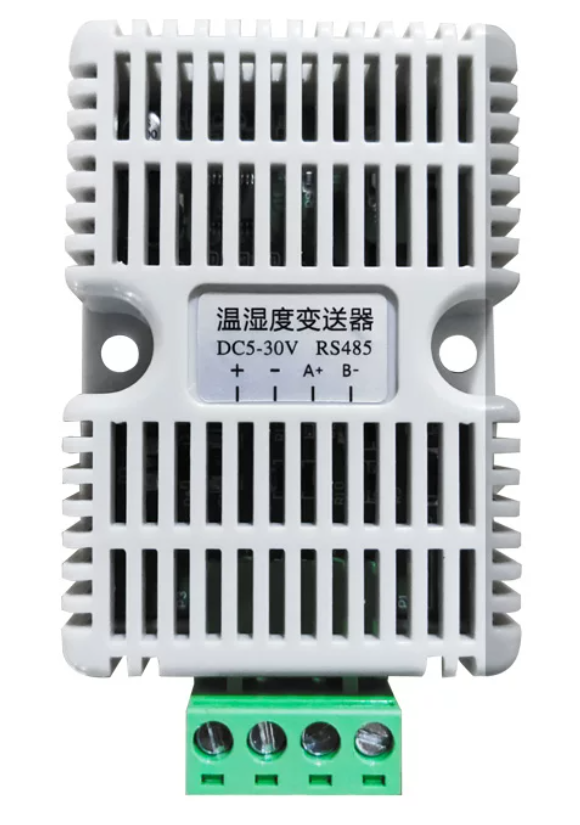

# Generic Modbus RTU Sensor Reader (C)

[简体中文](README.md) | **English**

Use [sensor_read.c](src/sensor_read.c) to read RS485 Modbus RTU data with addresses, types, scaling, and units taken from your sensor manual. It supports function codes `03` / `04`, 16/32-bit integers, and 32-bit floats. It does not write registers or detect sensor models. For combined temperature/humidity display, use the [temperature/humidity example](../temperature-humidity/README_EN.md).

## 1. Wiring and Power

Prepare a working Luckfox Lyra PLC, an RS485 Modbus RTU sensor, and a DC supply suitable for each device's rated input. Use SSH from the computer to upload the source.

A temperature/humidity sensor is used below to demonstrate wiring; follow the labels and manual for other sensors. Viewed from the front, its terminals are **`+`, `−`, `A+`, `B−` from left to right**. The label specifies **DC 5–30V**. The `+` / `−` terminals are called `DC+` / `DC−` in the table.




[Open the SVG wiring diagram](images/sensor-wiring.svg). The example sensor accepts **DC 5–30V** and uses a **12V supply**. The diagram shows the PLC and a non-isolated sensor sharing that supply. This is an electrical connection map; branch locations do not represent physical terminal positions. Follow the labels on your devices.

Disconnect power before wiring:

| Supply or PLC terminal | Connect to |
| --- | --- |
| 12V supply `DC+` | PLC power input positive and sensor `+` |
| 12V supply `DC−` | PLC power input negative and sensor `−` |
| PLC pin 10, `TA / A+` | Sensor `A` / `A+` |
| PLC pin 9, `TB / B−` | Sensor `B` / `B−` |
| PLC pin 6, `SGND` | Sensor RS485 signal ground; usually `DC−` on a non-isolated four-wire sensor |

The PLC accepts **7–24V** at its DC input and this sensor accepts **5–30V**, so both can share a **12V supply**. If you change sensors, choose a supply that matches the new sensor's rated voltage.

A shared supply already connects the power negatives. Do not assume the PLC power negative is its RS485 signal ground; use `SGND` for the bus reference as shown above. For an isolated sensor, follow the manufacturer's bus-side signal-ground definition and do not bridge the isolation with power ground. `PE` is protective earth and does not replace `SGND`. Leave RS422 pins 7 and 8 unconnected.

Use this pinout to locate the PLC terminals:


> The switches control termination only; they do not select RS485 or RS422 mode. Enabling both switches does not provide another serial port. Before changing to RS422, power off and configure the wiring and termination for the RS422 connection.

The program uses `/dev/ttyS2` and controls TXEN through `/dev/gpiochip0`, line `15` (`GPIO0_B7`), switching back to receive after transmission. Close any UART2 Web feature, serial terminal, or other application using the port before running it.

## 2. Select Parameters from the Manual

Check the serial settings, Modbus slave address, function code, protocol register address, data type, and conversion formula. Defaults are `9600 8N1`, slave `1`, function `03`, address `0`, and `1` register displayed as `u16`. The program reads once and exits.

- `-a` is the slave address; `-s` is the start address carried in the frame, in decimal or `0x` hexadecimal. If the manual maps reference `40001` to protocol address `0`, use `-s 0`. Follow the manufacturer's definition.
- `-q` counts **16-bit registers**, not bytes. One 32-bit value needs two registers, for example `-q 2 --type f32`.
- Conversion: **displayed value = decoded value × `--scale` + `--offset`**. `--unit` sets the display unit only; use `-a` for the slave address.
- All values in a request share one type, scale, offset, and unit. Read registers with different definitions in separate commands, sequentially, without opening the port from multiple programs.

## 3. Upload to the PLC and Build

**On the Ubuntu computer**, start at the repository root and enter this example. Replace `PLC_IP` with the PLC's actual IP address and adjust the username for your system.

```bash
cd protocols/modbus/rtu/c/sensor-read
ssh lyra@PLC_IP 'mkdir -p ~/sensor-read-example/src'
scp src/sensor_read.c lyra@PLC_IP:sensor-read-example/src/
ssh lyra@PLC_IP
```

**After logging in to the PLC**, compile:

```bash
cd ~/sensor-read-example
gcc -std=c11 -O2 -Wall -Wextra src/sensor_read.c -o sensor_read_plc
```

Run the generated `sensor_read_plc` on the PLC. If GCC is missing, install it first on an APT-based image:

```bash
sudo apt update
sudo apt install -y build-essential
```

The program needs only Linux system interfaces and the C standard library, with no Modbus library dependency. Source comments and program output are in English.

## 4. Read on the PLC

The commands below demonstrate parameter usage. Match the register definitions to your sensor manual.

Read holding registers 0 and 1 from slave 1 and include raw values:

```bash
sudo ./sensor_read_plc -a 1 -f 3 -s 0 -q 2 --raw
```

For temperature at address 0 as a signed 16-bit value with a scale of 0.1:

```bash
sudo ./sensor_read_plc -s 0 --type i16 --scale 0.1 --name Temperature --unit C
```

Example output (`[time]` represents the actual timestamp):

```text
[time] Temperature (R0): 27.6 C
Summary: successful=1, failed=0.
```

For humidity at address 1 as an unsigned 16-bit value with a scale of 0.1:

```bash
sudo ./sensor_read_plc -s 1 --type u16 --scale 0.1 --name Humidity --unit '%RH'
```

A 32-bit float example: 19200, 8E1, slave 2, function 04, two registers starting at 100, and CDAB byte order:

```bash
sudo ./sensor_read_plc -b 19200 -p E -a 2 -f 4 -s 100 -q 2 \
  --type f32 --order CDAB --name Pressure --unit kPa --precision 2
```

Add `-n 0 -i 1000` to any command for continuous reads once per second; press `Ctrl+C` to stop. Add `-n 10` for ten reads. For a finite run, `successful` matching the requested count and `failed=0` indicate successful reads.

## 5. Options and Baud Rate

Show all options with `./sensor_read_plc --help`.

| Option | Default | Purpose |
| --- | --- | --- |
| `-d PATH` | `/dev/ttyS2` | Serial device |
| `-b N` | `9600` | Baud rate; must match the sensor |
| `-p N\|E\|O` / `--stopbits 1\|2` | `N` / `1` | Parity / stop bits; data bits are fixed at 8 |
| `-a N` | `1` | Slave address, 1–247 |
| `-f 3\|4` | `3` | Holding / input registers |
| `-s N` / `-q N` | `0` / `1` | Start protocol address / register count (1–16) |
| `--type TYPE` | `u16` | Data type, listed below |
| `--scale N` / `--offset N` | `1` / `0` | Multiply by scale, then add offset |
| `--order ORDER` | `ABCD` | 32-bit byte order: `ABCD`, `BADC`, `CDAB`, `DCBA` |
| `--name TEXT` / `--unit TEXT` | None | Display name / unit |
| `--precision N` | Automatic | Fixed decimal places, 0–6 |
| `-n N` | `1` | Request count; `0` means continuous |
| `-i MS` / `-t MS` | `1000` / `1000` | Minimum interval between request starts / timeout, in milliseconds |
| `--raw` / `-v` | Off | Raw register values / TX and RX frames |
| `--gpiochip PATH` / `--txen-line N` | `/dev/gpiochip0` / `15` | Manual TXEN; enabled by default when the device name is `/dev/ttyS2` |
| `--auto-direction` | Automatic for other ports | Disable GPIO control for an automatic USB adapter |

| Type | Meaning | Registers per value |
| --- | --- | ---: |
| `u16` | Unsigned 16-bit integer | 1 |
| `i16` | Signed 16-bit two's complement integer | 1 |
| `signmag16` | High bit is the sign; remaining bits are the magnitude | 1 |
| `u32` / `i32` | Unsigned / signed 32-bit integer | 2 |
| `f32` | IEEE 754 single-precision float | 2 |

For 32-bit types, `-q` must be even. Set `--order` from the sensor manual. For example, `ABCD` uses the high word first with high byte first within each word; `CDAB` swaps the two 16-bit words.

**Change only `-b` to select a different baud rate; no rebuild is needed.** Supported rates are `1200`, `2400`, `4800`, `9600`, `19200`, `38400`, `57600`, and `115200`, subject to sensor and serial-port support. This option does not change the sensor's stored baud rate.

## 6. Optional: Read from a Computer with USB to RS485

Connect sensor A/B/signal ground to a USB to RS485 adapter with automatic direction control, then plug it into the computer. Power the sensor separately at its rated voltage. Disconnect the PLC's A/B during this test so two masters do not send requests on the same bus.

Run this before and after inserting the adapter. The new tty device is its serial port:

```bash
ls /dev/tty*
```

The commands below use `/dev/ttyACM0`; yours may be `/dev/ttyUSB0` or another name. Substitute the device you detected. Run in this example's directory on the computer:

```bash
sudo apt update
sudo apt install -y build-essential acl
sudo setfacl -m "u:$(id -un):rw" /dev/ttyACM0
gcc -std=c11 -O2 -Wall -Wextra src/sensor_read.c -o sensor_read_pc
./sensor_read_pc -d /dev/ttyACM0 --auto-direction -s 0 -q 1 --raw
```

Check the device name and grant access again after reconnecting USB. Build and run `_pc` on the computer and `_plc` on the PLC; these binaries are not interchangeable.

## 7. Makefile and Troubleshooting

With the complete example directory on the machine, use `make build` on the computer or `make build PLATFORM=plc` on the PLC. `PLATFORM` only selects the output name; it does not cross-compile. `make check` checks compiler warnings, `make run PLATFORM=plc ARGS="--help"` demonstrates the run target, and `make clean` removes generated binaries. Use the earlier `sudo` run commands to access the PLC hardware.

`make test` uses Python 3 and a simulated serial port to check decoding, CRC handling, timeouts, and cleanup. It needs no sensor. Python is used only for tests, not to run the C program.

| Symptom | Action |
| --- | --- |
| `Permission denied` | Use `sudo` on the PLC; grant serial access again on the computer |
| Serial port or GPIO busy | Close Web features and other programs using UART2 / GPIO15 |
| Timeout or CRC errors | Check power, A/B/SGND, baud rate, parity, and slave address; add `-v` to inspect frames |
| `Modbus exception` | Check the function code, protocol register address, and register count against the manual |
| Incorrect values or sign | Check register definitions, encoding, and scale; also check byte order for 32-bit data |
| `Exec format error` | Recompile the source on the machine where it will run |

Exit codes: `0` all reads succeeded; `1` read or decode failure; `2` argument or device setup error; `130` interrupted. On exit, the program releases TXEN and restores serial settings.
