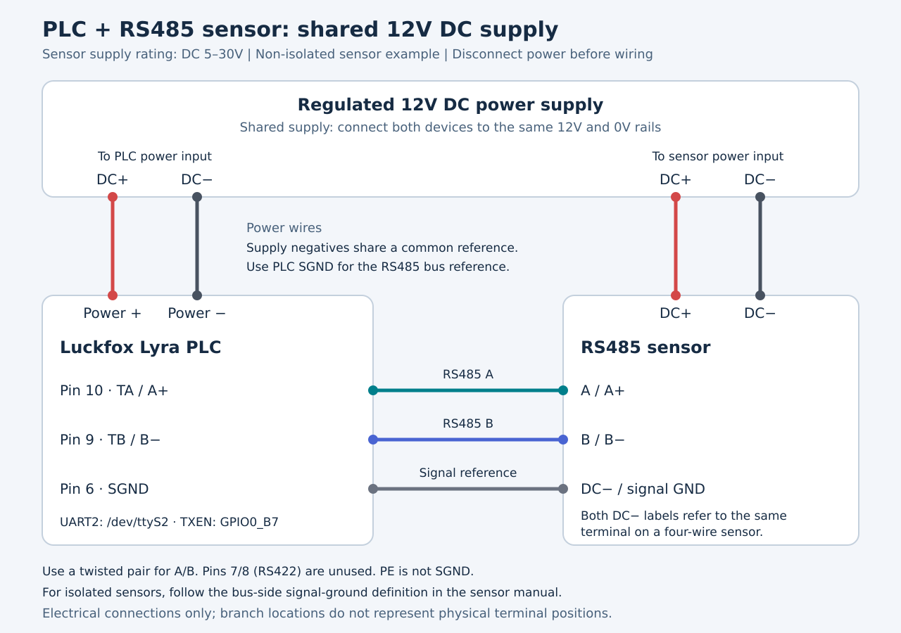

# RS485 温湿度传感器读取（C）

**简体中文** | [English](README_EN.md)

使用 [temperature_humidity.c](src/temperature_humidity.c) 在 Luckfox Lyra PLC 上读取 Modbus RTU 温湿度传感器，显示温度和相对湿度。支持功能码 `03` / `04`，不修改传感器寄存器。其他数据类型可使用 [通用传感器读取例程](../sensor-read/README.md)。

## 1. 接线与供电

准备已正常运行的 Luckfox Lyra PLC、RS485 Modbus RTU 传感器和符合设备额定电压的直流电源。电脑通过 SSH 上传源码。

本例使用的温湿度传感器如下。正面朝向自己时，端子从左到右为 **`+`、`−`、`A+`、`B−`**；铭牌供电范围为 **DC 5–30V**。`+` / `−` 即下表中的 `DC+` / `DC−`。




[查看 SVG 接线图](images/sensor-wiring.svg)。本例传感器的供电范围为 **DC 5–30V**，使用 **12V 电源**。图示为 PLC 与非隔离传感器共用该电源；图中表示电气连接关系，分线位置不代表实际端子位置，接线以设备标识为准。

断电后接线：

| 电源或 PLC 端子 | 连接到 |
| --- | --- |
| 12V 电源 `DC+` | PLC 电源输入正极、传感器 `+` |
| 12V 电源 `DC−` | PLC 电源输入负极、传感器 `−` |
| PLC 第 10 脚 `TA / A+` | 传感器 `A` / `A+` |
| PLC 第 9 脚 `TB / B−` | 传感器 `B` / `B−` |
| PLC 第 6 脚 `SGND` | 传感器 RS485 信号地；普通非隔离四线传感器通常为 `DC−` |

PLC 的直流端子输入范围为 **7–24V**，本例传感器为 **5–30V**，因此两者可以共用 **12V 电源**。更换传感器时，按新传感器的额定电压选择电源。

同一路电源的负极已共地，但 PLC 电源负极不应直接当作 RS485 信号地；总线参考地按上表接 `SGND`。隔离传感器按厂家定义连接总线侧信号地，不要用电源负极跨接隔离两侧。`PE` 是保护地，不代替 `SGND`。RS422 的第 7、8 脚本例不接。

PLC 的实际端子编号见下图：


> 拨码只控制终端电阻，不用于选择 RS485/RS422 通信模式；同时打开两个拨码也不会增加一路串口。改用 RS422 时，应先断电，按 RS422 接线和总线终端要求重新配置。

程序使用 `/dev/ttyS2`，默认通过 `/dev/gpiochip0` 的第 `15` 号线（`GPIO0_B7`）控制 TXEN，自动完成发送后切回接收。运行前关闭占用 UART2 的 Web 功能、串口助手和其他程序。

## 2. 确认传感器参数

先查看传感器说明书。本程序的默认配置如下，**不是所有温湿度传感器的统一定义**；型号和寄存器不会自动识别。

| 项目 | 默认配置 |
| --- | --- |
| 串口 | `9600`，8 数据位、无校验、1 停止位（8N1） |
| 从站地址 / 功能码 | `1` / `03`（保持寄存器） |
| 温度 | 协议地址 `0`，16 位有符号整数（补码），乘 `0.1` 得到 °C |
| 湿度 | 协议地址 `1`，16 位无符号整数，乘 `0.1` 得到 %RH |

地址参数使用 Modbus 报文中的协议地址，支持十进制和 `0x` 十六进制。若手册的 `40001` 对应协议地址 `0`，就传 `0`，不要直接传 `40001`。以厂家地址定义为准。

## 3. 上传到 PLC 并编译

**在 Ubuntu 电脑上**，从仓库根目录进入本例程目录。将 `PLC_IP` 替换为 PLC 的实际 IP，用户名按实际系统修改。

```bash
cd protocols/modbus/rtu/c/temperature-humidity
ssh lyra@PLC_IP 'mkdir -p ~/temperature-humidity-example/src'
scp src/temperature_humidity.c lyra@PLC_IP:temperature-humidity-example/src/
ssh lyra@PLC_IP
```

**登录 PLC 后**编译：

```bash
cd ~/temperature-humidity-example
gcc -std=c11 -O2 -Wall -Wextra src/temperature_humidity.c -o temperature_humidity_plc
```

生成的 `temperature_humidity_plc` 在 PLC 上运行。如果没有 GCC，在支持 APT 的镜像上先安装：

```bash
sudo apt update
sudo apt install -y build-essential
```

程序仅依赖 Linux 系统接口和 C 标准库，无需安装 Modbus 库。源码中的注释和运行输出为英文。

## 4. 在 PLC 读取

传感器与上面的默认配置一致时，先读取一次：

```bash
sudo ./temperature_humidity_plc --once
```

连续读取，每秒一次，按 `Ctrl+C` 停止：

```bash
sudo ./temperature_humidity_plc -n 0 -i 1000
```

读取三次并显示原始值：

```bash
sudo ./temperature_humidity_plc -n 3 --raw
```

输出示例（`[time]` 表示实际时间，读数随环境变化）：

```text
[time] Temperature: 27.6 °C  Humidity: 59.0 %RH  [Raw: temperature=276, humidity=590]
Summary: successful=3, failed=0.
```

有限次数读取结束后，`successful` 等于请求次数且 `failed=0` 表示本轮读取成功；单位和数值仍需与传感器寄存器表核对。

## 5. 参数与波特率

完整帮助：`./temperature_humidity_plc --help`。

| 参数 | 默认值 | 用途 |
| --- | --- | --- |
| `-d PATH` | `/dev/ttyS2` | 串口设备 |
| `-b N` | `9600` | 波特率，与传感器一致 |
| `-a N` | `1` | Modbus 从站地址，1–247 |
| `-f 3\|4` | `3` | 读取保持寄存器 / 输入寄存器 |
| `--parity N\|E\|O` | `N` | 无 / 偶 / 奇校验 |
| `--stop-bits 1\|2` | `1` | 停止位 |
| `--temperature-register N` | `0` | 温度协议地址 |
| `--humidity-register N` | `1` | 湿度协议地址 |
| `--temperature-scale N` / `--humidity-scale N` | `0.1` | 原始值的换算倍率 |
| `--temperature-format FORMAT` | `signed` | `signed` 补码、`unsigned` 无符号、`sign-magnitude` 最高位表示符号 |
| `--precision N` | `1` | 小数位数，0–4 |
| `--once` / `-n N` | 连续 | 单次 / 指定次数；`-n 0` 连续 |
| `-i MS` / `-t MS` | `1000` / `1000` | 最小采样起始间隔 / 每个请求超时（毫秒） |
| `--raw` / `-v` | 关闭 | 原始寄存器值 / 收发报文 |
| `--gpiochip PATH` / `--txen-line N` | `/dev/gpiochip0` / `15` | PLC TXEN 控制参数，通常无需修改 |
| `--auto-direction` | 关闭 | USB 转换器自动切换收发时使用 |

**换波特率只修改 `-b`，无需改源码或重新编译。** 支持 `1200`、`2400`、`4800`、`9600`、`19200`、`38400`、`57600`、`115200`，实际值须受传感器和串口支持；该参数不会修改传感器自身的设置。

例如，手册规定 19200、8E1、从站 2、功能码 04、温度地址 10、湿度地址 11、倍率均为 0.01 时：

```bash
sudo ./temperature_humidity_plc -b 19200 --parity E -a 2 -f 4 \
  --temperature-register 10 --humidity-register 11 \
  --temperature-scale 0.01 --humidity-scale 0.01 --once
```

## 6. 可选：电脑通过 USB 转 RS485 读取

将传感器的 A/B/信号地接到支持自动收发切换的 USB 转 RS485 转换器，转换器接电脑 USB。传感器仍按额定电压独立供电。测试时断开 PLC 的 A/B，避免两个主站同时发请求。

在 Ubuntu 电脑插入转换器前后分别执行，新增的 tty 设备就是转换器串口：

```bash
ls /dev/tty*
```

下面以 `/dev/ttyACM0` 为例；实际也可能是 `/dev/ttyUSB0` 等，替换为自己电脑检测到的名称。在电脑的本例程目录执行：

```bash
sudo apt update
sudo apt install -y build-essential acl
sudo setfacl -m "u:$(id -un):rw" /dev/ttyACM0
gcc -std=c11 -O2 -Wall -Wextra src/temperature_humidity.c -o temperature_humidity_pc
./temperature_humidity_pc -d /dev/ttyACM0 --auto-direction --once
```

USB 重新插拔后重新确认设备名并授权。`_pc` 在电脑编译和运行，`_plc` 在 PLC 编译和运行，不能混用。

## 7. Makefile 与常见问题

也可在具有完整例程目录的机器上使用 `make build`（电脑）或 `make build PLATFORM=plc`（PLC）。`PLATFORM` 只决定文件名，不进行交叉编译。`make check` 检查编译警告，`make run PLATFORM=plc ARGS="--help"` 演示运行入口，`make clean` 删除生成的可执行文件。实际访问 PLC 设备时使用前面的 `sudo` 运行命令。

| 现象 | 处理方法 |
| --- | --- |
| `Permission denied` | PLC 用 `sudo` 运行；电脑重新授予串口权限 |
| 串口或 GPIO 忙 | 关闭占用 UART2 / GPIO15 的 Web 功能和其他程序 |
| 超时、CRC 错误 | 检查供电、A/B/SGND、波特率、校验位和从站地址；加 `-v` 查看报文 |
| `Modbus exception` | 对照手册检查功能码、协议寄存器地址和读取数量 |
| 数值或正负号不正确 | 检查温湿度寄存器地址、温度编码方式和倍率 |
| `Exec format error` | 在当前机器上重新编译源码 |

退出码：`0` 全部读取成功；`1` 读取或解析失败；`2` 参数或设备配置错误；`130` 用户中断。退出时程序释放 TXEN，并恢复串口配置。
